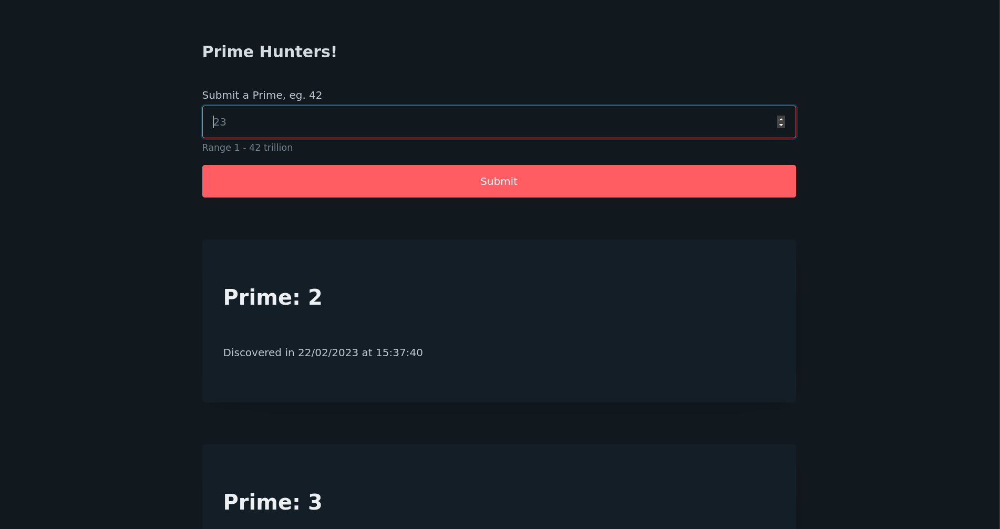

# Prime Hunters

> a (pico)Simple CRUD application but not a todo list :)

database for discovering primes in range (1-42 trillion)

## Used

- [FastAPI](https://fastapi.tiangolo.com/)
  - [Uvicorn](https://www.uvicorn.org/)
  - [Jinja2](https://jinja.palletsprojects.com/en/3.1.x/)
  - [python-multipart](https://andrew-d.github.io/python-multipart/)
- [PICO.CSS](https://picocss.com/)

### Swagger API documentation

### Redoc API documentation

### Home aka `/`

### feedback on valid prime submission

### Feedback on invalid prime submission

